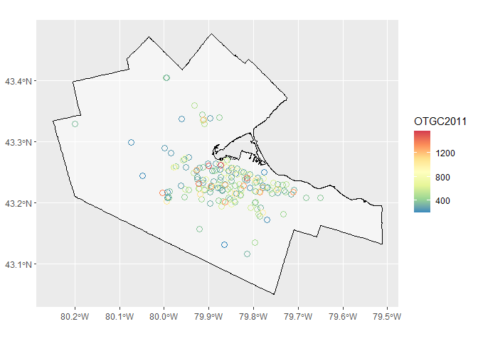
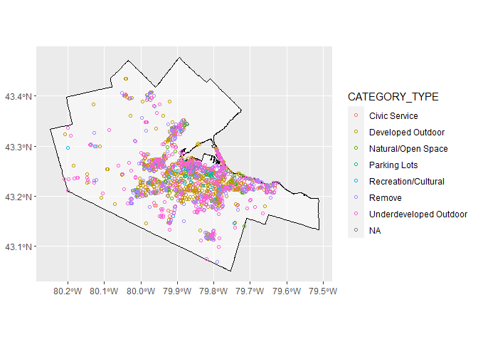
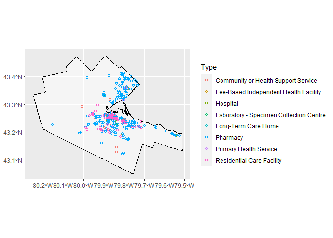
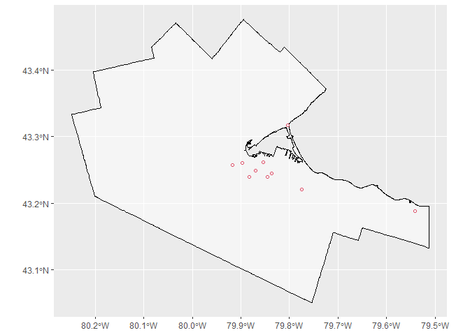

<!-- README.md is generated from README.Rmd. Please edit that file -->

# HamONdest

<!-- badges: start -->
<!-- badges: end -->

The goal of HamONdest is to compile all potential destinations (Schools,
municipally-owned land, health care and residential care facilities,
etc.) and their estimated ‘supplies’ in Hamilton, Ontario, Canada all in
one data-package to facilitate the calculation of accessibility and
mobility measures in the transportation planning context. The majority
of data is sourced from [Hamilton’s Open Data
Portal](https://open.hamilton.ca/) and is augmented with additional open
data from higher levels of government (provincial and federal),
predicted values, and/or data from
[OpenStreetMap](https://www.openstreetmap.org).

The HamONdest package is still a work in progress and is available
[here](https://github.com/soukhova/HamONDest-package)

## Installation

You can install the released version of HamONdest using:

``` r
if(!require(remotes)){
    install.packages("remotes")
    library(remotes)
}
remotes::install_github("soukhova/HamONdest-package",
                         build_vignettes = TRUE)
```

## Examples

``` r
library(HamONdest)
library(ggplot2)
library(dplyr)
library(sf)
```

The data package contains the following destinations in Hamilton,
Ontario.

### Schools

Elementary and Secondary Public and Public Catholic Schools in **2011**,
size based on on-the-ground-capacity (OTGC)

``` r
ggplot() +
  geom_sf(data = Ham_CityBound,
          size = 0.5,
          alpha = 0.5,
          color  = "black",
          fill = "white") +
  geom_sf(data = Schools_201516_201011 %>% filter(Year != "2016"),
          aes(col = OTGC2011),
          shape = 1,
          size = 3) +
  scale_color_distiller(palette = "Spectral")
```



Elementary and Secondary Public and Public Catholic Schools in **2016**,
size based on on-the-ground-capacity (OTGC)

``` r
ggplot() +
  geom_sf(data = Ham_CityBound,
          size = 0.5,
          alpha = 0.5,
          color  = "black",
          fill = "white")+
  geom_sf(data = Schools_201516_201011 %>% filter(Year != "2011"),
          aes(col = OTGC2016),
          shape = 1,
          size = 3) +
  scale_color_distiller(palette = "Spectral")
```


### Municipally-Owned Properties (Parks, Open Space, Vacant Land, + Properties with civil services like fire stations, police station, community centres, etc.)

Up-to-date City-Owned Property with person destination potential.
Sourced from Open Data Hamilton.

``` r
ggplot() +
  geom_sf(data = Ham_CityBound,
          size = 0.5,
          alpha = 0.5,
          color  = "black",
          fill = "white")+
  geom_sf(data = City_Owned_Property,
          aes(col = CATEGORY_TYPE),
          shape = 1) 
```



### Health and community care service providers (Clincs, Hospitals, Residential Care Facilties, Community )

All Health and community care service providers as sourced from City of
Hamilton Open Data and Ontario GeoHub:

``` r
ggplot() +
  geom_sf(data = Ham_CityBound,
          size = 0.5,
          alpha = 0.5,
          color  = "black",
          fill = "white")+
  geom_sf(data = Care_Facilities,
          aes(col = Type),
          shape = 1) 
```


Let’s see locations for a specific, service provider type, like
Hospital:

``` r
ggplot() +
  geom_sf(data = Ham_CityBound,
          size = 0.5,
          alpha = 0.5,
          color  = "black",
          fill = "white")+
  geom_sf(data = Care_Facilities %>% filter(Type == "Hospital"),
          color = 2,
          shape = 1)
```



## More Information

Coordinate system of all data:

``` r
sf::st_crs(Schools_201516_201011)
#> Coordinate Reference System:
#>   User input: EPSG:4326 
#>   wkt:
#> GEOGCRS["WGS 84",
#>     DATUM["World Geodetic System 1984",
#>         ELLIPSOID["WGS 84",6378137,298.257223563,
#>             LENGTHUNIT["metre",1]]],
#>     PRIMEM["Greenwich",0,
#>         ANGLEUNIT["degree",0.0174532925199433]],
#>     CS[ellipsoidal,2],
#>         AXIS["geodetic latitude (Lat)",north,
#>             ORDER[1],
#>             ANGLEUNIT["degree",0.0174532925199433]],
#>         AXIS["geodetic longitude (Lon)",east,
#>             ORDER[2],
#>             ANGLEUNIT["degree",0.0174532925199433]],
#>     USAGE[
#>         SCOPE["unknown"],
#>         AREA["World"],
#>         BBOX[-90,-180,90,180]],
#>     ID["EPSG",4326]]
```

This data package is still a work in progress. See additional
visualizations and uses in the Vignettes.
